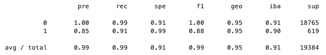
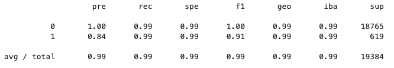

# Credit Risk Resampling -- Report

---
## Overview of the Analysis

### The purpose of this analysis
To determine whether a lender can accurately predict future potential healthy and high-risk borrowers based on 77,536 real life data points.

### The financial information provided & what the lender needs to predict
I was given the `lending_data.csv` file with 77,536 rows of current borrower data from the lender. This data included their loan amount, interest rate, income, debt-to-income ratio, amount of open accounts, any derogatory marks, total debt, and loan status. The lender needs to be able to predict whether future potential borrowers will be of healthy or high risk.

### Attempted predictions and methods used
* Separated the loan_status column from the rest of the dataframe and put it in its own variable `y`
* Put the rest of the columns in their own new dataframe with the variable `X`
* Used `y.value_counts()` to get an idea of how many borrowers are healthy (`0`) and how many are high-risk (`1`)
    * Healthy (`0`) = 75036 & High-risk (`1`) = 2500
    * The dataset is very imbalances with 96.77% of the borrowers being classified as healthy
* Ran `random_oversampler = RandomOverSampler(random_state=1)` in order to get a resampled dataset with equal amounts of `0` and `1` data
    * Saved this data in new variables: `X_resampled, y_resampled`
    * And used `fit_resample(X_train, y_train)` to train the new variables
* Used `y_resampled.value_counts()` to verify they data is equal
    * Healthy (`0`) = 56271 & High-risk (`1`) = 56271
    * Confirmed

### Machine learning process and methods used

* Split the data into four variables `X_train, X_test, y_train, y_test` in order to run a logistics regression prediction
* Ran a logistics regression prediction on both the original and resampled data
    * Used `LogisticRegression(random_state=1)`, `model.fit(X_train, y_train)`, and `model.predict(X_test)`
* Checked the `balanced_accuracy_score`
* Checked the `confusion_matrix`
* Printed a `classification_report_imbalanced`

---
## Results and Summary

### Machine Learning Model_Original

* Accuracy
    * The `balanced_accuracy_score` returned 0.9520479254722232
        * About 95.2% accurate, which is pretty good

* Precision
    * For the healthy borrowers is 100%
        * Of all the borrowers predicted to be healthy, the model correctly classified 100% of them
    * For the high-risk borrowers is 85%
        * Of all the borrowers predicted to be high-risk, the model correctly classified 85% of them
* Recall scores
    * For the healthy borrowers is 99%
        * Of all the borrowers which actually truly are healthy, the model correctly classified 99% of them
    * For the high-risk borrowers is 91%
        * Of all the borrowers which actually truly are high-risk, the model correctly classified 91% of them

### Machine Learning Model_Resampled

* Accuracy
    * The `balanced_accuracy_score` returned 0.9936781215845847
        * About 99.3% accurate, which is very good
        

    
* Precision
    * For the healthy borrowers is 100%
        * Of all the borrowers predicted to be healthy, the model correctly classified 100% of them
    * For the high-risk borrowers is 84%
        * Of all the borrowers predicted to be high-risk, the model correctly classified 84% of them
* Recall scores
    * For the healthy borrowers is 99%
        * Of all the borrowers which actually truly are healthy, the model correctly classified 99% of them
    * For the high-risk borrowers is 99%
        * Of all the borrowers which actually truly are high-risk, the model correctly classified 99% of them

### Summary and Recommendation
Both models have very good accuracy, however, I would recommend the lender use the resampled data for the following reasons:
* It is about 4% more accurate than the original data
* While the data is about 1% less correctly classified where precision, high-risk is concerned, this is negligible compared to the 8% increase in correct classifications where recall, high-risk is concerned
    * And because the count of high-risk borrowers is of more importance to a lender than the count of healthy borrowers, the lender will be glad to have a 99% accurate prediction for potential future borrowers who are actually truly high risk